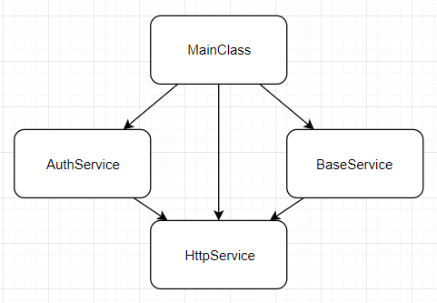

# simpliest-DI-ts
simpliest emplementation Dependency Injection on TypeScript

_код представлен для изучения подхода_

#Dependency Injection
Это подход, который облегчает создание объектов в приложении.

###Пример
Приложение из 4-х объектов, со следующими связами:


```ts
class HttpService {
  constructor() {
    console.log(`HttpService is created.`);
  }
}

class MainClass {
  public _baseService: BaseService;
  public _authService: AuthService;

  constructor() {
    this._baseService = new BaseService();
    this._authService = new AuthService();
    console.log(`MainClass is created.`);
  }
}

class BaseService {
  public _httpService: HttpService;

  constructor() {
    this._httpService = new HttpService();
    console.log(`BaseService is created.`);
  }
}

class AuthService {
  public _httpService: HttpService;

  constructor() {
    this._httpService = new HttpService();
    console.log(`AuthService is created.`);
  }
}


const mainClass = new MainClass();
```