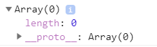

# simpliest-DI-ts
simpliest emplementation Dependency Injection on TypeScript

_код представлен для изучения подхода_

# Dependency Injection
Это подход, который облегчает создание объектов в приложении.

### Пример
Приложение из 4-х объектов, со следующими связами:


```ts
class HttpService {
  constructor() {
    console.log(`HttpService is created.`);
  }
}

class MainClass {
  public _baseService: BaseService;
  public _authService: AuthService;

  constructor() {
    this._baseService = new BaseService();
    this._authService = new AuthService();
    console.log(`MainClass is created.`);
  }
}

class BaseService {
  public _httpService: HttpService;

  constructor() {
    this._httpService = new HttpService();
    console.log(`BaseService is created.`);
  }
}

class AuthService {
  public _httpService: HttpService;

  constructor() {
    this._httpService = new HttpService();
    console.log(`AuthService is created.`);
  }
}


const mainClass = new MainClass();
```

Проблема этого варианта реализации в том, что он статический. Если в ходе выполнения программы зависимость должна будет поменяться, например: AuthService должен будет сменить зависимость с HttpService на BaseService, то это будет невозможно.

Также этот вариант не соответствует концепции IoC - пятому принципу S.O.L.I.D., который гласит, что класс не должен быть жестко закодирован (в нашем случае статическими зависимостями), а должен зависить от абстракции. Т.е. класс должен выполнять только свои обязанности, в которые не входит создание объектов, нужных для исполнения этих обязанностей.

Этот вариант можно переписать на удовлетворяющий концепции IoC:

```ts
class HttpService {
  constructor() {
    console.log(`HttpService is created.`);
  }
}

class MainClass {
  constructor(
    public _baseService: BaseService,
    public _authService: AuthService,
    public _httpService: HttpService,
  ) {
    console.log(`MainClass is created.`);
  }
}

class BaseService {
  constructor(
    public _httpService: HttpService,
  ) {
    console.log(`BaseService is created.`);
  }
}

class AuthService {
  constructor(
    public _httpService: HttpService,
  ) {
    this._httpService = new HttpService();
    console.log(`AuthService is created.`);
  }
}


const mainClass = new MainClass(
  new BaseService(new HttpService()),
  new AuthService(new HttpService()),
  new HttpService(),
);
```

Но от статичности мы не избавились, код выглядит не красиво и затрудняется модульное тестирование.

Теперь представим, что сервисы должны быть Singleton, для того, чтобы для всех обращающихся объектов состояние было одинаковым. Это усложняет расширяемость приложения, а также добавляет глобальных переменных.

Решение этих проблем - контейнер зависимосей - объект, который знает, как создавать остальные объекты и предоставлять к ним доступ другим объектам. 

При реализации будет использоваться подход constructor injection. В качестве идентификаторов объектов контейнер может оперировать типами или именами входных парамметров. Реализация так же возможно через:

* setter injection - через set метод объекта для внедрения зависимостей;
* interface injection - предоставление инжектору метода для внедрения зависимостей. Этот метод описывается в итерфейсе.

Определим класс (контейнер) с методом для внедрения зависимостей:
```ts
export default class DependencyContainer {
    public resolve(target: any) {
        // получаем список заинжекченных классов
    }
}
```
Так как после компиляции типы не будут доступы в коде js, то нет нативного способа в run time получить типы параметров конструктора ( ну или я не нашел:) ).

Поэтому буду использовать библиотеку reflect-metadata, методы которой такую возможность предоставляют.

```ts
import 'reflect-metadata';

export default class DependencyContainer {
    public static resolve(target: any) {
        // получаем список заинжекченных классов
        const targets = Reflect.getMetadata('design:paramtypes', target) || [];
        console.dir(targets);
    }
}
```
Результат:

Элементов 0, хотя MainClass имеет 3 прямых зависимости. Такой результат из-за того, что метод ожидает, что переданный класс будет декорирован специальным декоратором, который реализуем ниже:
```ts
export const InjectableClass = (target) => {
    // здесь можно взаимодействовать с конструктором через target
}
```
Типизируем target, чтобы дать понять, что мы ожидаем именно класс:
```ts
export interface ConstructorType<T> {
    new(...args: any[]): T;
}

export const InjectableClass = (target: ConstructorType<any>) => {
    // здесь можно взаимодействовать с конструктором
}
```

Необходимо заметить, что подход DI подразумевает от мануального использования оператора new. Учитывая это, немного изменим наш пример:
```ts
import DependencyContainer from './dependency-container';
import { InjectableClass } from './util';

class HttpService {
  constructor() {
    console.log(`HttpService is created.`);
  }
  getInfo() {
    return {
      isAdmin: false
    }
  }
}

class BaseService {
  constructor(
    public _httpService: HttpService,
    ) {
      console.log(`BaseService is created.`);
  }
}

class AuthService {
  constructor(
    public _httpService: HttpService,
    ) {
      this._httpService = new HttpService();
      console.log(`AuthService is created.`);
    }
    checkIsAdmin() {
      return this._httpService.getInfo().isAdmin;
    }
  }
  
@InjectableClass
class MainClass {
  constructor(
    public _baseService: BaseService,
    public _authService: AuthService,
    public _httpService: HttpService,
  ) {
    console.log(`MainClass is created.`);
  }

  public check() {
    console.log(this._authService.checkIsAdmin());
  }
}
const diContainer = new DependencyContainer();

const mainObj = diContainer.resolve(MainClass);

mainObj.check(); // ожидаем false
```

Первичная реализация контейнера зависимостей:
```ts
import 'reflect-metadata';
import { ConstructorType } from './util';

export default class DependencyContainer {
    public static resolve(target: ConstructorType<any>) {
        // получаем список заинжекченных классов
        const targets = Reflect.getMetadata('design:paramtypes', target) || [];
        // итерируем по свойствам зависимых классов и создаем их экземпляры рекурсивно
        const injectors = targets.map(injector => DependencyContainer.resolve(injector));

        // target === (текущий класс), injectors === (объекты инжектируемых классов)
        return new target(...injectors); 
    }
}
```
Результат в консоли после выполнения кода со статическим внедрением зависимостей (начальная реализация)

Итоговый результат:


Как видно объекты инжектируемых классов создаются 1 раз. Внедрение зависимостей работает.

Создадим объект класса AuthService:
```ts
...

const diContainer = new DependencyContainer();

const mainObj = diContainer.resolve(MainClass);
const authObj = diContainer.resolve(AuthService);

mainObj.check(); // ожидаем false
```
Результат в консоли:


Результат говорит о том, что сервисы не Singleton.

Исправим это:

```ts
import 'reflect-metadata';
import { ConstructorType } from './util';

export default class DependencyContainer extends Map {
    public resolve(target: ConstructorType<any>) {
        // получаем список заинжекченных классов
        const targets = Reflect.getMetadata('design:paramtypes', target) || [];
        // итерируем по свойствам зависимых классов и создаем их экземпляры рекурсивно
        const injectors = targets.map(injector => this.resolve(injector));

        let entity = this.get(target);

        if (entity) {
            return entity;
        }
        // target === (текущий класс), injectors === (объекты инжектируемых классов)
        entity = new target(...injectors);
        this.set(target, entity);

        return entity;
    }
}
```

Отнаследовавшись от класса Map, у нас появилась возможность сохранять созданные объекты.

Результат в консоли:

Как видно классы инстанцируются единожды, сколько бы мы ни создавали объектов, классы которых зависимы от других.

### Ссылки
[внедрение зависимостей](https://medium.com/@xufocoder/a-quick-intro-to-dependency-injection-what-it-is-and-when-to-use-it-de1367295ba8)
[nehalist.io/dependency-injection-in-typescript](https://nehalist.io/dependency-injection-in-typescript/)
[dependency-injection-di-container-in-typescript](https://medium.com/@OlegVaraksin/minimalistic-dependency-injection-di-container-in-typescript-2ce93d1c303b)